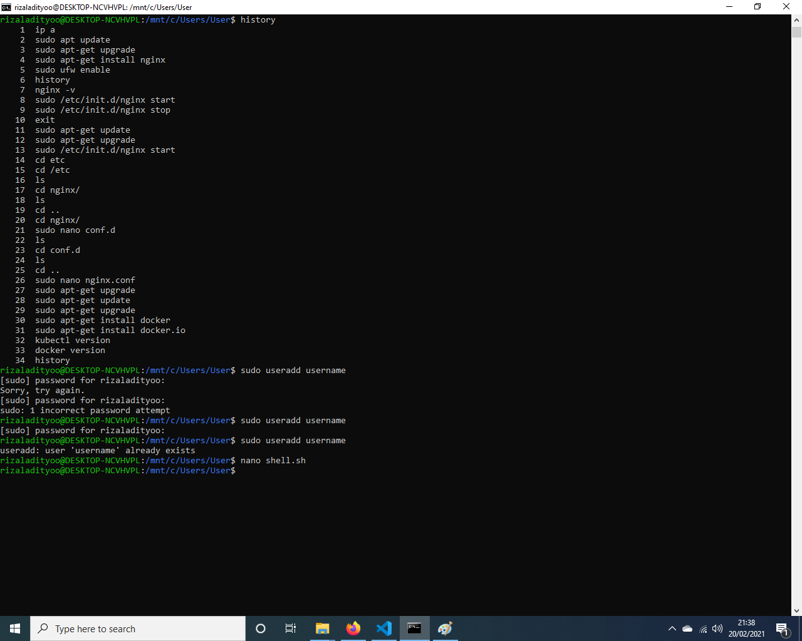
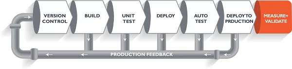
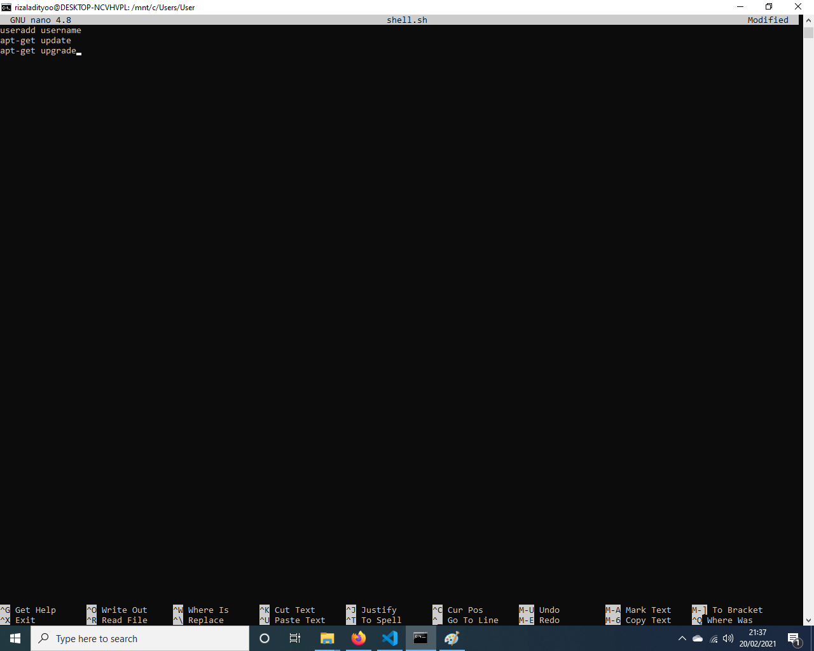
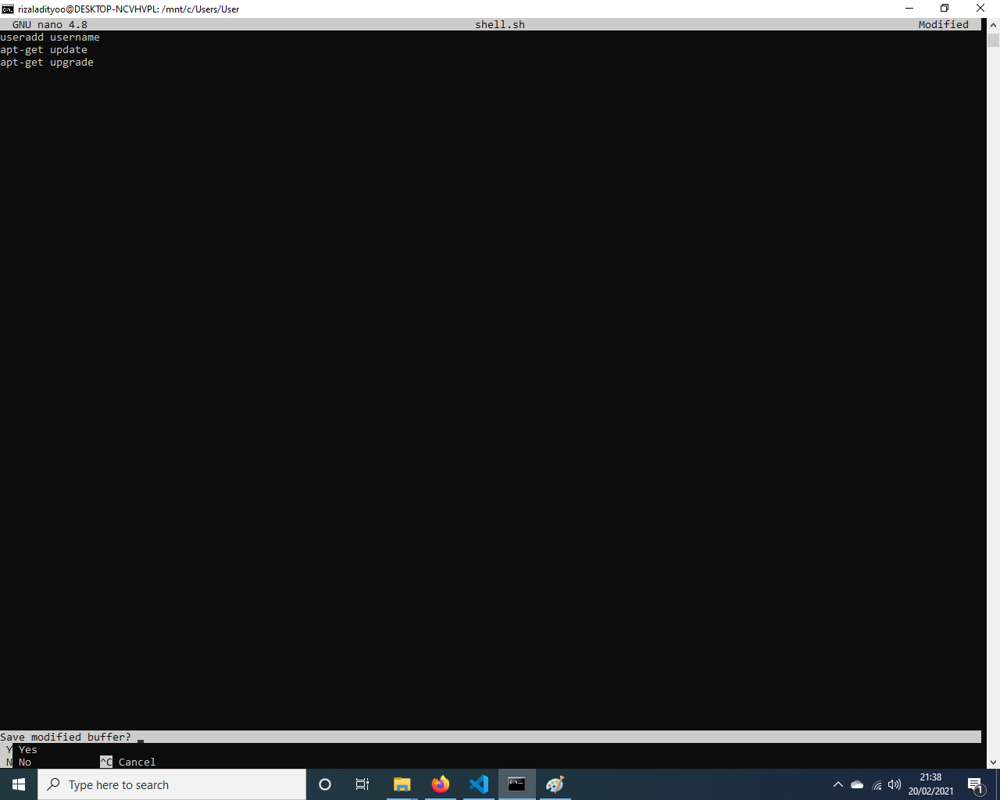
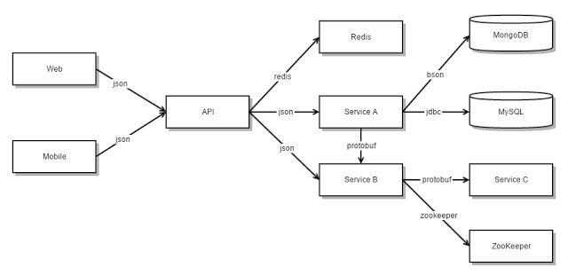
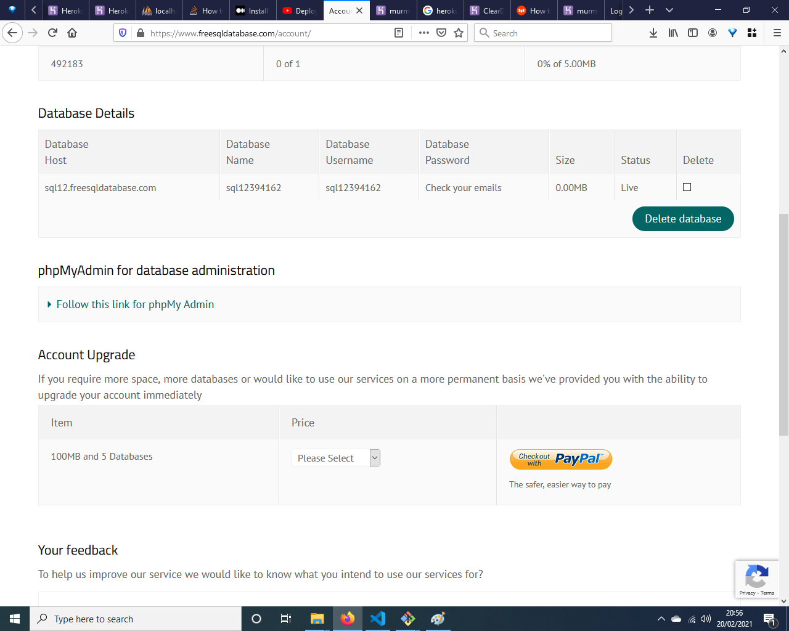

Sistem Operasi Windows 10

1. DevOps adalah istilah untuk sebuah kultur dimana tim Developer dan tim Operation bekerja sama dalam proses development sebuah aplikasi agar lebih cepat dan efisien. 
Penting untuk mempersingkat proses development agar tidak terjadi delay antara team developer dan operation, untuk memperpendek waktu server tidak bisa diakses karena kesulitan menangani bug atapun versioning.
Alur kerja
    - Developer menulis kode secara lokal di laptop
    - Developer mengupload kode ke server Test
    - QA/Tester melakukan pengecekan. Gagal. Tester melapor ke Developer
    - Developer melakukan Rollback
    - Developer menulis kode secara lokal di laptop
    - Developer mengupload kode ke server Test
    - QA/Tester melakukan pengecekan. Berhasil
    - Developer mengupload kode ke Server Production
 (sumber https://blog.cilsy.id/2018/07/apa-itu-devops.html)

 2. Docker adalah sebuah aplikasi yang bersifat open source yang berfungsi sebagai wadah/container untuk mengepak/memasukkan sebuah software secara lengkap beserta semua hal lainnya yang dibutuhkan oleh software tersebut dapat berfungsi. Pengaturan software beserta file/hal pendukung lainnya akan menjadi sebuah Image (istilah yang diberikan oleh docker). Kemudian sebuah instan dari Image tersebut kemudian disebut Container. (sumber https://www.dewaweb.com/blog/tutorial-docker-dalam-bahasa-indonesia/)
Kubernetes adalah platform open source yang digunakan untuk manajemen container
 (sumber https://medium.com/sannycloud/apa-itu-kubernetes-k8s-af4e68f7c358)
-   persamaan : opensource
-   perbedaan : docker untuk otomatisasi build dan deploy aplikasi (container), kubernetes otomatisasi management container (infrasruktur)

 3. jalankan perintah history di terminal linux 

 4. karena apabila tidak ada ci/cd proses development aplikasi akan cenderung lebih lambat dan juga kurang praktis 

 5. (mohon maaf tidak bisa embed video di readme.md)
 -  ketik di terminal : nano shell.sh
 -  ketik useradd username (enter) apt-get update (enter) apt-get upgrade
 -  tekan ctrl+x dan tekan y dan enter
    
    
 6. (mohon maaf tidak bisa embed video di readme.md)
 -  git init
 -  git add .
 -  git commit -m "frist commit"
 -  git remote add origin git@github.com:<username>/<namarepo>.git
 -  git push origin <nama branch>

 7.  (sumber https://medium.com/codelabs-unikom/microservices-apaan-tuh-b9f5d56e8848)

 8. Komputer yang sudah diinstal heroku cli, sudah login heroku dan sudah mempunyai project wordpress yang akan dideploy, kemudian ikuti langkah-langkah berikut ini :
     -  buat file bernama procfile dan ketik web: vendor/bin/heroku-php-nginx 
     -  buka project wordpress menggunakan git bash dan masukan perintah git init
     -  kemudian masukan perintah git add . 
     -  kemudian masukan perintah git commit -m "initial commit" 
     -  kemudian masukan perintah heroku create
     -  kemudian masukan perintah git push heroku master 
     -  buka, signup, dan buat database baru di https://www.freesqldatabase.com/
     -  buka url yang sudah dicreate oleh heroku tadi (http://murmuring-sierra-89897.herokuapp.com) 
     -  masukkan config database yang telah dibuat di situs https://www.freesqldatabase.com/ 